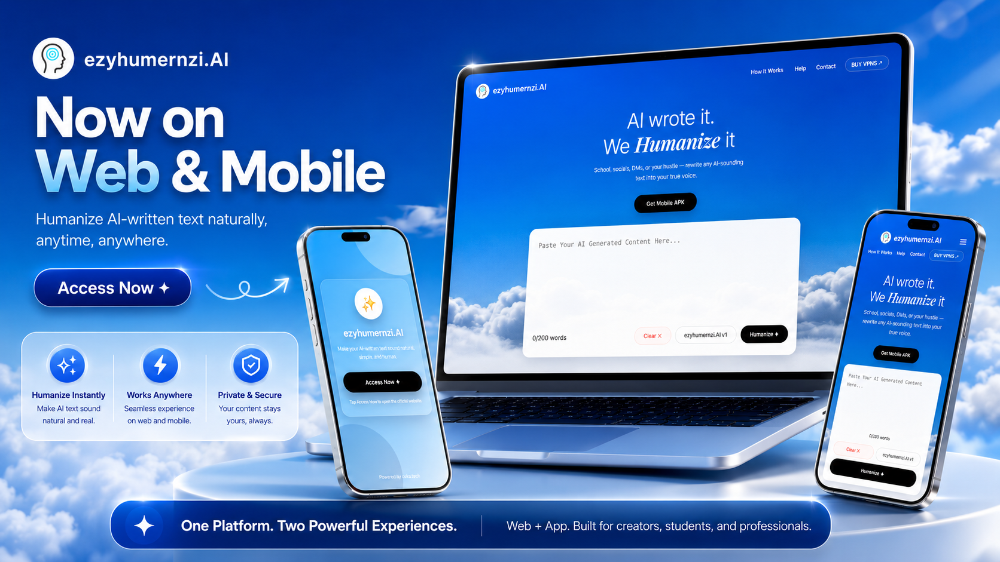
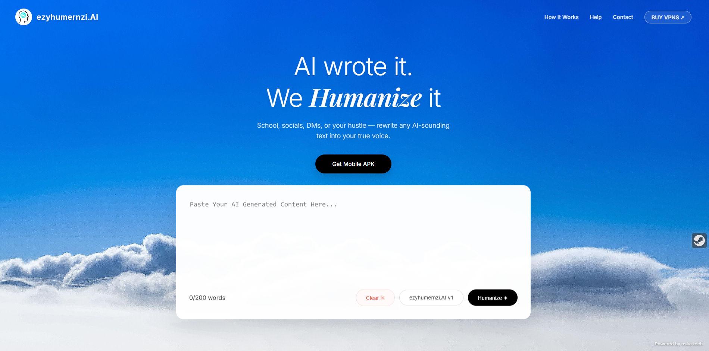
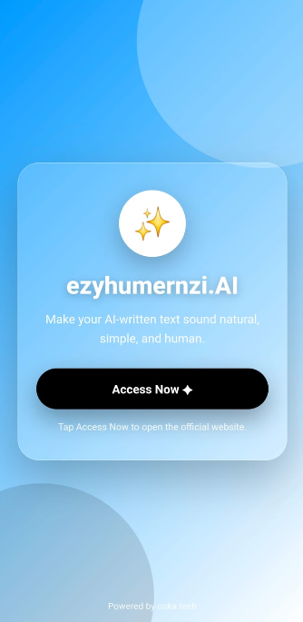
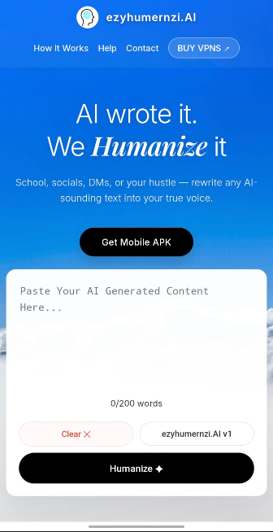

# ezyhumernzi.AI ✦  
### Humanize AI-written text naturally — on Web & Mobile



**ezyhumernzi.AI** is a simple, modern AI humanizer platform that helps users rewrite AI-generated content into natural, clear, and human-sounding text.  
Built for students, creators, writers, professionals, and anyone who wants their text to feel more real.

---

## 🌐 Live Website

👉 **Visit:** [https://ezyhumernzi.ai.oskaa.tech](https://ezyhumernzi.ai.oskaa.tech)

---

## ✨ Features

- 🤖 Humanize AI-generated text
- ✍️ Make writing sound natural and simple
- 🌐 Web-based experience
- 📱 Mobile app access page
- ⚡ Fast and clean user interface
- 🎨 Modern sky-themed responsive design
- 🔒 Simple and privacy-focused experience
- 📋 Copy humanized text instantly

---

## 📱 Web + Mobile Experience

ezyhumernzi.AI works as a web platform and also provides a lightweight Android app experience.

The mobile app opens a clean welcome screen and lets users access the official website easily through their phone browser.

---

## 🖼 Preview

### Desktop Web



### Mobile App



### Mobile Web



---

## 🚀 Tech Stack

This project is built using:

- **HTML5**
- **CSS3**
- **JavaScript**
- **Capacitor**
- **Android**
- **Vercel**
- **Gemini API**

---

## 📂 Project Structure

```txt
AI-HUMANIZER
├── api
│   └── humanize.js
├── android
├── assets
│   ├── banner.png
│   ├── desktop-preview.png
│   ├── mobile-app-preview.png
│   └── mobile-web-preview.png
├── www
│   └── index.html
├── index.html
├── capacitor.config.json
├── package.json
└── README.md